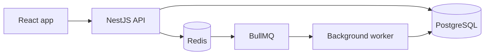
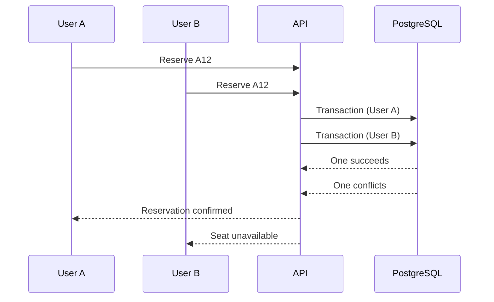

# OneSeat

OneSeat is a small event booking app I'm building to practice backend development. The name comes from the one rule the whole project is built around: one seat, one person.

The question behind it is simple: what happens when two people try to book the same seat at the same time?

A basic "check if the seat is free, then book it" flow doesn't work here. Both requests can see the seat as free before either of them saves a reservation. This project is mostly about solving that problem properly, instead of building another CRUD app.

**Status:** Phase 1 (backend foundation). The NestJS app connects to PostgreSQL running in Docker, and migrations work with a first `users` table. Authentication is next. I'll update this README as I go.


## What it will do

- Register and log in, with admin and user roles
- Admins create events and seats
- Users browse events and choose a seat
- Users reserve seats, see their reservations and cancel them
- Seats are held for a short time while someone is reserving
- Confirmation emails are sent in the background
- API documentation with Swagger

## Tech stack

- **Backend:** NestJS, TypeScript
- **Database:** PostgreSQL
- **Cache / temporary data:** Redis
- **Background jobs:** BullMQ
- **Frontend:** React, TypeScript
- **Testing:** Jest, Supertest
- **Containers:** Docker, Docker Compose
- **CI:** GitHub Actions
- **Cloud:** AWS
- **Infrastructure:** Terraform

## Architecture

For now I'm keeping the backend as a modular monolith. I don't want to split a small project into microservices just to say I used them. One NestJS application is easier to build and deploy, and I can still keep the code organized in clear modules.



The API and the worker can run as separate processes, but they live in the same codebase.

## The main problem: double booking

This is the part of the project I care about most.

Imagine two users click "Reserve" on seat A12 at almost the same moment. A naive implementation would:

1. Check if A12 is available
2. Create a reservation if it is

If both requests run step 1 before either one finishes step 2, both think the seat is free. That's a race condition.

The database should have the final word here, not the application code.



My plan is to use PostgreSQL transactions and a unique constraint on the event and seat, instead of relying on Redis for the final check. PostgreSQL is the source of truth for reservations. If cancelled reservations stay in the table, the constraint will only apply to the active ones, so a cancelled seat can be reserved again.

## Redis and BullMQ

Redis will be used for temporary seat holds and as the backend for BullMQ.

For example, when a reservation has a time limit, a background job can release the seat after it expires. Jobs should also be safe to run twice. If the same job is retried, it must not leave the data in a wrong state.

## Testing

I don't want the concurrency part to work only in theory, so one of the tests will send many requests for the same seat at the same time. Something like 50 requests for the same event and seat, and the database should end up with exactly one valid reservation. The exact numbers don't matter, the result does.

I'll also write the usual unit and integration tests around the reservation flow.

## Project structure

This is the plan for now, and it will probably change as the project grows.

```
src/
├── auth/
├── users/
├── events/
├── seats/
├── reservations/
├── notifications/
├── common/
└── main.ts
```

## Running it locally

The local setup is meant to run with Docker Compose. It doesn't work yet, because the project is just starting.

```bash
git clone https://github.com/fatkoou/oneseat.git
cd oneseat
cp .env.example .env
docker compose up --build
```

Planned local ports:

- Frontend: `localhost:5173`
- API: `localhost:3000`
- PostgreSQL: `localhost:5432`
- Redis: `localhost:6379`

## Security checklist

Basic things I want to get right. I'll tick them only when they are really done.

- [ ] Hash passwords (bcrypt or argon2)
- [ ] Validate all incoming data
- [ ] Rate limit the login endpoint
- [ ] Users can only access their own reservations
- [ ] Keep secrets in environment variables, never in the code
- [ ] Set up CORS and security headers properly

## Roadmap

**Phase 1: core backend**

- [x] NestJS project setup
- [x] Docker Compose with PostgreSQL
- [x] Database migrations
- [ ] Authentication and roles
- [ ] Events and seats
- [ ] Reservations without double booking
- [ ] Concurrent reservation test

**Phase 2: shipping it**

- [ ] React frontend (login, event list, seat selection, my reservations)
- [ ] GitHub Actions
- [ ] Docker production image
- [ ] AWS deployment, HTTPS and health checks

**Phase 3: extras**

- [ ] Redis seat holds and reservation expiration
- [ ] BullMQ jobs with retries and email notifications
- [ ] Terraform
- [ ] Logging

## What this project covers

- Handling concurrent requests
- Database transactions and constraints
- Reliable background jobs
- Useful integration tests
- Dockerizing an application
- CI/CD with GitHub Actions
- Deploying to AWS
- Managing infrastructure with Terraform

The architecture will probably change while I learn, and I'll update this README when it does.

## About me

I'm Fadil Bajrami, a junior developer looking for backend and full-stack opportunities.

- GitHub: [fatkoou](https://github.com/fatkoou)
- LinkedIn: [Fadil Bajrami](https://www.linkedin.com/in/fadil-bajrami-662b141b1)

## License

MIT
