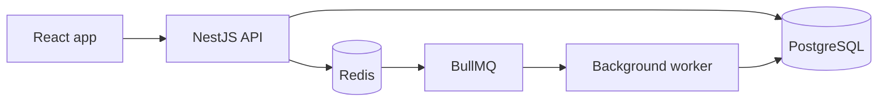
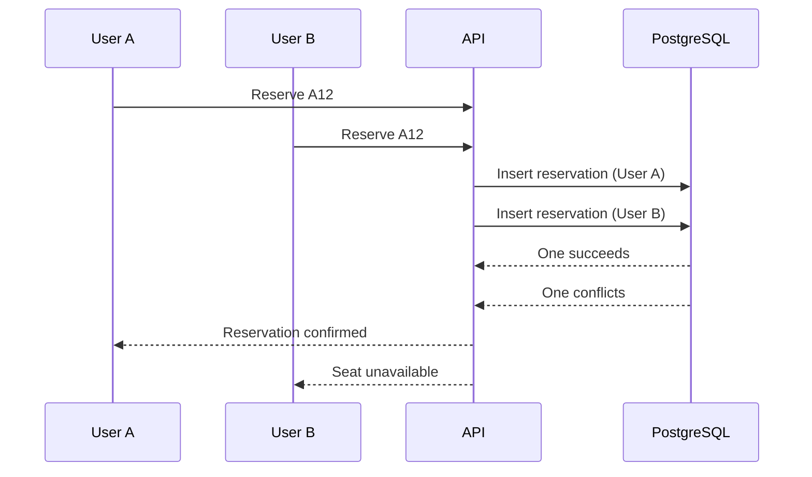

# OneSeat


OneSeat is an event seat reservation backend. The name is the one rule the whole project is built around: one seat, one person.

The question behind it is simple: what happens when two people try to book the same seat at the same time?

A basic "check if the seat is free, then book it" flow doesn't work here. Both requests can see the seat as free before either of them saves a reservation. This project is mostly about solving that problem properly, instead of building another CRUD app.

**Status:** The core backend works: users can register and log in, admins create events and generate seats from a layout, and users can reserve and cancel seats. A test sends 50 concurrent requests for the same seat and exactly one succeeds. Unit tests, API docs, a frontend and deployment are still ahead. I'll update this README as I go.

## What it does

**Working now**

- Register and log in with JWT, with admin and user roles
- Admins create events and generate seats from a layout (sections, rows, seat counts) instead of adding them one by one
- Users reserve a seat, list their reservations and cancel them
- A seat can have only one confirmed reservation, enforced by PostgreSQL
- API documentation with Swagger

**Planned**

- Seats held for a short time while someone is reserving
- Confirmation emails in the background
- A React frontend

## Tech stack

**In use**

- **Backend:** NestJS, TypeScript
- **Database:** PostgreSQL, TypeORM
- **Auth and validation:** JWT (`@nestjs/jwt`), argon2, class-validator
- **Testing:** Jest, Supertest
- **Containers:** Docker, Docker Compose
- **API docs:** Swagger / OpenAPI
- **CI:** GitHub Actions

**Planned**

- **Cache / temporary data:** Redis
- **Background jobs:** BullMQ
- **Frontend:** React, TypeScript
- **Cloud:** AWS
- **Infrastructure:** Terraform

## Architecture

For now I'm keeping the backend as a modular monolith. I don't want to split a small project into microservices just to say I used them. One NestJS application is easier to build and deploy, and I can still keep the code organized in clear modules.



Right now only the API and PostgreSQL exist. The rest is planned.

The API and the worker can run as separate processes, but they live in the same codebase.

## The main problem: double booking

This is the part of the project I care about most.

Imagine two users click "Reserve" on seat A12 at almost the same moment. A naive implementation would:

1. Check if A12 is available
2. Create a reservation if it is

If both requests run step 1 before either one finishes step 2, both think the seat is free. That's a race condition.

The database should have the final word here, not the application code.



This is how it works now. The `reservations` table has a partial unique index on the seat, and it only covers confirmed reservations:

```sql
CREATE UNIQUE INDEX "UQ_reservations_active_seat"
ON reservations (seat_id)
WHERE status = 'confirmed';
```

The API doesn't check if the seat is free first. It just inserts. If PostgreSQL rejects the insert because of the index, the API returns `409 Conflict`. Cancelling a reservation only changes its status to `cancelled`, so the row stays in the table but the seat can be reserved again.

PostgreSQL is the source of truth for reservations. Redis is not part of this check.

## Seat layouts

Admins don't create seats one by one. They describe the layout of the room and the API generates the seats:

```
POST /events/{eventId}/seats/generate
```

```json
{
  "sections": [
    {
      "name": "VIP",
      "rows": [
        { "label": "A", "seatCount": 8, "startNumber": 1 },
        { "label": "B", "seatCount": 8, "startNumber": 1 }
      ]
    },
    {
      "name": "GENERAL",
      "rows": [{ "label": "C", "seatCount": 20, "startNumber": 1 }]
    }
  ]
}
```

The request is validated and limited (at most 5000 seats per request). The seats are created with one bulk insert. A seat is identified by event, section, row and number, and a unique constraint rejects duplicates with a `409`.

## Redis and BullMQ

Redis will be used for temporary seat holds and as the backend for BullMQ. This is planned for Phase 3.

For example, when a reservation has a time limit, a background job can release the seat after it expires. Jobs should also be safe to run twice. If the same job is retried, it must not leave the data in a wrong state.

## Testing

The concurrency test is the one I care about most. It starts the app against a separate test database, creates one seat and 50 users, and sends 50 reservation requests for that seat at the same time. It checks that exactly one request gets `201`, the other 49 get `409`, and the database holds exactly one confirmed reservation.

To make sure the test really tests something, I dropped the partial unique index in the test database and ran it again. All 50 requests succeeded and the test failed. So the protection comes from the database, not from the application code.

One honest note: the requests are sent together, but the connection pool limits how many of them reach PostgreSQL at the same moment. So this tests concurrent requests, not 50 simultaneous writes.

I also have unit tests for the seat layout logic and for the error handling in the users and reservations services. They use a mocked repository, run in milliseconds and don't need a database. They check my own logic. The guarantee against double booking is checked by the concurrency test, because only a real database can prove it.

## Project structure

```
backend/
├── src/
│   ├── auth/            # register, login, JWT and role guards
│   ├── common/          # shared helpers (database errors)
│   ├── config/          # environment helpers
│   ├── database/        # database config
│   ├── events/          # events
│   ├── health/          # health check
│   ├── migrations/      # TypeORM migrations
│   ├── reservations/    # reserve, list and cancel
│   ├── seats/           # seat layout generation
│   ├── users/           # user entity and users service
│   ├── app.module.ts
│   ├── app.setup.ts     # shared app config (validation)
│   ├── data-source.ts   # data source for the TypeORM CLI
│   └── main.ts
└── test/                # e2e tests
```

Planned module: `notifications`. The structure will probably change as the project grows.

## Running it locally

You need Docker, Docker Compose and Node.js (I'm using Node 24). For now only PostgreSQL runs in Docker, and the API runs directly on your machine.

```bash
git clone https://github.com/fatkoou/oneseat.git
cd oneseat
cp .env.example .env
docker compose up -d
cd backend
npm install
npm run migration:run
npm run start:dev
```

Set your own database password and a long random `JWT_SECRET` in `.env` before starting.

Then open `http://localhost:3000`. Then open http://localhost:3000/health/ready to check that the app can reach the database, or http://localhost:3000/docs for the API documentation.

Local ports:

- API: `localhost:3000`
- PostgreSQL: `localhost:5432`

### Running the tests

The tests use a separate database called `oneseat_test`. They empty its tables, so they refuse to run against any other database.

```bash
docker compose exec db psql -U oneseat -d oneseat -c "create database oneseat_test;"
cd backend
npm run migration:run:test
npm run test:e2e
```
The same steps run on every push with GitHub Actions.

## Environment variables

Copy `.env.example` to `.env` in the repo root. The real `.env` is never committed.

| Variable | Description |
| --- | --- |
| `POSTGRES_USER` | Database user |
| `POSTGRES_PASSWORD` | Database password |
| `POSTGRES_DB` | Database name |
| `DB_HOST` | Database host (`localhost` when running locally) |
| `DB_PORT` | Database port (`5432`) |
| `JWT_SECRET` | Secret used to sign tokens. Generate one with `openssl rand -base64 48` |

## API

Interactive docs are available at http://localhost:3000/docs when the app is running.

| Method | Route | Auth | Description |
| --- | --- | --- | --- |
| `POST` | `/auth/register` | none | Create an account |
| `POST` | `/auth/login` | none | Log in and get an access token (valid for 15 minutes) |
| `GET` | `/auth/me` | Bearer token | Return the current user from the token |
| `GET` | `/events` | none | List events |
| `GET` | `/events/:id` | none | Get one event |
| `POST` | `/events` | Admin | Create an event |
| `GET` | `/events/:eventId/seats` | none | List the seats of an event |
| `POST` | `/events/:eventId/seats/generate` | Admin | Generate seats from a layout |
| `POST` | `/reservations` | Bearer token | Reserve a seat |
| `GET` | `/reservations/me` | Bearer token | List my reservations |
| `POST` | `/reservations/:id/cancel` | Bearer token | Cancel one of my reservations |
| `GET` | `/health/live` | none | Liveness check |
| `GET` | `/health/ready` | none | Readiness check (checks the database) |


New accounts are always regular users. For now I make someone an admin by changing the `role` column in the database.

## Security checklist

Basic things I want to get right. I'll tick them only when they are really done.

- [x] Hash passwords with argon2
- [x] Validate all incoming data
- [ ] Rate limit the login endpoint
- [x] Users can only access their own reservations
- [x] Keep secrets in environment variables, never in the code
- [ ] Set up CORS and security headers properly
- [x] Check production dependencies for known vulnerabilities in CI (npm audit)

## Roadmap

**Phase 1: core backend**

- [x] NestJS project setup
- [x] Docker Compose with PostgreSQL
- [x] Database migrations
- [x] Authentication and roles
- [x] Events and seats
- [x] Reservations without double booking
- [x] Concurrent reservation test
- [x] Unit tests

**Phase 2: shipping it**

- [x] Swagger / OpenAPI docs
- [x] Health check endpoint
- [x] GitHub Actions
- [ ] Docker production image
- [ ] AWS deployment, HTTPS and health checks
- [ ] React frontend (login, event list, seat selection, my reservations)

**Phase 3: extras**

- [ ] Redis seat holds and reservation expiration
- [ ] BullMQ jobs with retries and email notifications
- [ ] Terraform
- [ ] Logging

## What this project covers

- Handling concurrent requests
- Database transactions and constraints
- Reliable background jobs
- Useful integration tests
- Dockerizing an application
- CI/CD with GitHub Actions
- Deploying to AWS
- Managing infrastructure with Terraform

The architecture will probably change while I learn, and I'll update this README when it does.

## About me

I'm Fadil Bajrami, a junior developer looking for backend and full-stack opportunities.

- GitHub: [fatkoou](https://github.com/fatkoou)
- LinkedIn: [Fadil Bajrami](https://www.linkedin.com/in/fadil-bajrami-662b141b1)

## License

MIT
