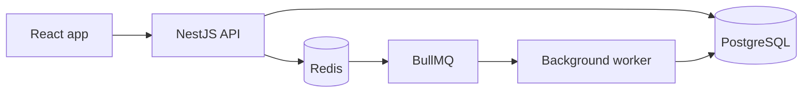
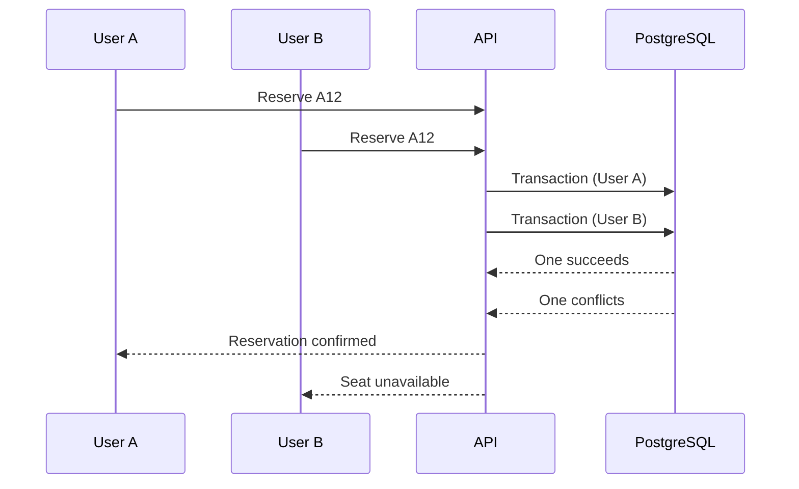

# OneSeat

OneSeat is an event seat reservation backend. The name is the one rule the whole project is built around: one seat, one person.

The question behind it is simple: what happens when two people try to book the same seat at the same time?

A basic "check if the seat is free, then book it" flow doesn't work here. Both requests can see the seat as free before either of them saves a reservation. This project is mostly about solving that problem properly, instead of building another CRUD app.

**Status:** Phase 1 (backend foundation). The NestJS app connects to PostgreSQL running in Docker, migrations work, and users can register and log in with JWT. Roles are checked with guards. Events and seats are next. I'll update this README as I go.

## What it will do

- Register and log in, with admin and user roles
- Admins create events and seats
- Users browse events and choose a seat
- Users reserve seats, see their reservations and cancel them
- Seats are held for a short time while someone is reserving
- Confirmation emails are sent in the background
- API documentation with Swagger

## Tech stack

**In use**

- **Backend:** NestJS, TypeScript
- **Database:** PostgreSQL, TypeORM
- **Auth and validation:** JWT (`@nestjs/jwt`), argon2, class-validator
- **Containers:** Docker, Docker Compose

**Planned**

- **Cache / temporary data:** Redis
- **Background jobs:** BullMQ
- **Frontend:** React, TypeScript
- **API docs:** Swagger / OpenAPI
- **Testing:** Jest and Supertest come with the NestJS template, but I haven't written real tests yet
- **CI:** GitHub Actions
- **Cloud:** AWS
- **Infrastructure:** Terraform

## Architecture

For now I'm keeping the backend as a modular monolith. I don't want to split a small project into microservices just to say I used them. One NestJS application is easier to build and deploy, and I can still keep the code organized in clear modules.



Right now only the API and PostgreSQL exist. The rest is planned.

The API and the worker can run as separate processes, but they live in the same codebase.

## The main problem: double booking

This is the part of the project I care about most.

Imagine two users click "Reserve" on seat A12 at almost the same moment. A naive implementation would:

1. Check if A12 is available
2. Create a reservation if it is

If both requests run step 1 before either one finishes step 2, both think the seat is free. That's a race condition.

The database should have the final word here, not the application code.



My plan is to use PostgreSQL transactions and a unique index on the event and seat, instead of relying on Redis for the final check. PostgreSQL is the source of truth for reservations. If cancelled reservations stay in the table, the index will only cover the active ones (a partial unique index), so a cancelled seat can be reserved again.

## Redis and BullMQ

Redis will be used for temporary seat holds and as the backend for BullMQ. This is planned for Phase 3.

For example, when a reservation has a time limit, a background job can release the seat after it expires. Jobs should also be safe to run twice. If the same job is retried, it must not leave the data in a wrong state.

## Testing

I don't want the concurrency part to work only in theory, so one of the tests will send many requests for the same seat at the same time. Something like 50 requests for the same event and seat, and the database should end up with exactly one valid reservation. The exact numbers don't matter, the result does.

I'll also write the usual unit and integration tests around the reservation flow.

## Project structure

What exists today, inside `backend/`:

```
backend/src/
├── auth/            # register, login, JWT and role guards
├── config/          # environment helpers
├── database/        # database config
├── migrations/      # TypeORM migrations
├── users/           # user entity and users service
├── app.module.ts
├── data-source.ts   # data source for the TypeORM CLI
└── main.ts
```

Planned modules: `events`, `seats`, `reservations` and `notifications`. The structure will probably change as the project grows.

## Running it locally

You need Docker, Docker Compose and Node.js (I'm using Node 24). For now only PostgreSQL runs in Docker, and the API runs directly on your machine.

```bash
git clone https://github.com/fatkoou/oneseat.git
cd oneseat
cp .env.example .env
docker compose up -d
cd backend
npm install
npm run migration:run
npm run start:dev
```

Set your own database password and a long random `JWT_SECRET` in `.env` before starting.

Then open `http://localhost:3000`. The root route still returns the "Hello World!" from the NestJS template. The real endpoints are listed in the API section below.

Local ports:

- API: `localhost:3000`
- PostgreSQL: `localhost:5432`

## Environment variables

Copy `.env.example` to `.env` in the repo root. The real `.env` is never committed.

| Variable | Description |
| --- | --- |
| `POSTGRES_USER` | Database user |
| `POSTGRES_PASSWORD` | Database password |
| `POSTGRES_DB` | Database name |
| `DB_HOST` | Database host (`localhost` when running locally) |
| `DB_PORT` | Database port (`5432`) |
| `JWT_SECRET` | Secret used to sign tokens. Generate one with `openssl rand -base64 48` |

## API

| Method | Route | Auth | Description |
| --- | --- | --- | --- |
| `POST` | `/auth/register` | none | Create an account |
| `POST` | `/auth/login` | none | Log in and get an access token (valid for 15 minutes) |
| `GET` | `/auth/me` | Bearer token | Return the current user from the token |

## Security checklist

Basic things I want to get right. I'll tick them only when they are really done.

- [x] Hash passwords with argon2
- [ ] Validate all incoming data
- [ ] Rate limit the login endpoint
- [ ] Users can only access their own reservations
- [x] Keep secrets in environment variables, never in the code
- [ ] Set up CORS and security headers properly

## Roadmap

**Phase 1: core backend**

- [x] NestJS project setup
- [x] Docker Compose with PostgreSQL
- [x] Database migrations
- [x] Authentication and roles
- [ ] Events and seats
- [ ] Reservations without double booking
- [ ] Concurrent reservation test

**Phase 2: shipping it**

- [ ] React frontend (login, event list, seat selection, my reservations)
- [ ] Swagger / OpenAPI docs
- [ ] GitHub Actions
- [ ] Docker production image
- [ ] AWS deployment, HTTPS and health checks

**Phase 3: extras**

- [ ] Redis seat holds and reservation expiration
- [ ] BullMQ jobs with retries and email notifications
- [ ] Terraform
- [ ] Logging

## What this project covers

- Handling concurrent requests
- Database transactions and constraints
- Reliable background jobs
- Useful integration tests
- Dockerizing an application
- CI/CD with GitHub Actions
- Deploying to AWS
- Managing infrastructure with Terraform

The architecture will probably change while I learn, and I'll update this README when it does.

## About me

I'm Fadil Bajrami, a junior developer looking for backend and full-stack opportunities.

- GitHub: [fatkoou](https://github.com/fatkoou)
- LinkedIn: [Fadil Bajrami](https://www.linkedin.com/in/fadil-bajrami-662b141b1)

## License

MIT
